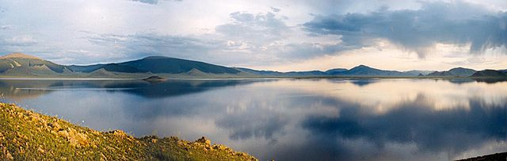

# On The Grassland

> On The Grassland is a continuing story from the end of JinYong's novel The Heavenly Sword and Dragon Saber  

Copyright © 2019 - 2021 by Pongsak Suvanpong All Rights Reserved (psksvp@gmail.com)

__This work must not be sold for any form of monetary returned. It must always be free to read.__

Version : [ 1554 ]
Date : [ Thu 25 May 2023 18:25:15 AEST ]

# License

[Creative Commons Non-Commercial Share Alike 4.0](https://creativecommons.org/licenses/by-nc-nd/4.0/legalcode)

# News and Notes

[News and Notes](https://www.facebook.com/hsdsMe/)

# Preface

This story is my imagination run wild after reading the [Condor Trilogy](https://en.wikipedia.org/wiki/Condor_Trilogy) novels by [Jin Yong](https://en.wikipedia.org/wiki/Jin_Yong). There are three novels in the trilogy. I love all three of them, but the one that captivates me the most is the [Heavenly Sword and Dragon Saber](https://en.wikipedia.org/wiki/The_Heaven_Sword_and_Dragon_Saber) (HSDS). 

I have never written a story before, but I have read many in wide variety of genres. The [wuxia](https://en.wikipedia.org/wiki/Wuxia) genre is one that I like, though only Jin Yong novels that I have read. I have tried other wuxia authors, but they somehow cannot keep me reading until the end like those from Jin Yong.

The main reason that I am writing is to satisfy myself. I feel I do not have enough. I want more, I want the story to continue. The other reason is, I feel the ending is not really the ending. It is kind of a rush to finish.

This novel is also available in ebook format; EPUB and PDF. Please email me <psksvp@gmail.com> if you would like a copy to read offline. The ebooks have been produced by a great free software; [pandoc](https://pandoc.org/). The manuscript for this novel was prepared using [Markdown](https://www.markdownguide.org/) markup language. 

# Warning

Most of this writing is unedited. There are grammatical, spelling errors and wrong words used. I am trying my best to fix any error before I commit, however it is hard to put myself in a reader's eyes.

If you see any errors, please email me (psksvp@gmail.com). Please also let me know if you like or hate it. I can also be reached through [twitter page (https://twitter.com/hsdsme/)](https://twitter.com/hsdsme). I will announce the availability of a new chapter in the twitter page.

# How to Read

The novel should be read in the sequential order from the lower to the higher chapter number. Each chapter has its conclusion, but many clues and characters are connected from chapter 41. Before reading, please also read the [The Plot section](#the-plot). 

1. Reading Online; [Please click here.](https://psksvp.gitlab.io/hsdsme/mpt.html)

2. Downloads for Offline Reading

	Due to low demand, please email me [psksvp@gmail.com](mailto:psksvp@gmail.com) if you would like me to put these files (EPUB, MOBI and PDF) back. 

<!--    You can download ebook in **epub** or **pdf** to read offline. They are always in sync with the online version. The Current Version is **1554**, published on **Thu 25 May 2023 18:25:15 AEST** .
    
    [Click here to download ebook files](https://psksvp.gitlab.io/hsdsme/download.html)

    The ebooks have been produced by a great free software; [pandoc](https://pandoc.org/). The manuscript for this novel was prepared using [Markdown](https://www.markdownguide.org/) markup language.-->

# The Plot 

This story line branched out from the novel right after the event at Shaolin temple [but before our main characters; Zhang Wuji and Zhao Min were drugged by Zhu Yuanzhang](https://wuxiasociety.com/the-heaven-sword-and-the-dragon-sabre-chapter-40/14/).  

After the event at Shaolin, Zhang Wuji and Zhao Min had been spending their happy time together at the Ming Cult Central Command Center for about three months. Zhao Min was always by Zhang Wuji's side everywhere he went.

As Zhang Wuji was the cult Jiaozhu, Zhao Min started to feel that if she stayed by his side, she would cause the conflict between Zhang Wuji and his subordinates. So she decided to leave.

Though she wanted Zhang Wuji to leave the post as the leader of the Ming Cult and followed her, but she did not want to force him. She asked Zhang Wuji to come find her, when he was ready to do so. She moved herself out of the Central Plains to the far Northwest region on the Grassland. 

Three years later, at the end of the summer time in the Central Plains, Zhang Wuji suddenly decided to leave the Jiaozhu position, and left the Central Plains to find his Zhao Min. Yang Xiao pleaded him not to leave, but he fail to stop Zhang Wuji. Yang Xiao noticed that Zhang Wuji seemed to be very angry with something in the cult, but he did not know exactly why. Before Zhang Wuji left, he passed the Jiaozhu position to Yang Xiao.

After Zhang Wuji found Zhao Min on the Grassland in the far west region of Mongolia near Central Asia, they were having their sweetest time together for a few days. Then Zhang Wuji found out that Zhao Min did not just wait for him, she still played a very big role in shaping the political power in the Central Plains. In doing so, she had built a small Kingdom which she called *Zeng AhNuo*. 

# Table of Contents

[Chapter 41   : A Cactus Can Be Very Sweet.](https://psksvp.gitlab.io/hsdsme/zm.html#chapter-41) 

> Zhao Min shouted while she was still running, *"Zhang Wuji! Let us stop kidding around now, the horses don't like it. My subordinates at the trading post could hear us!"*

[Chapter 42   : A New Doctor On The Grass Land.](https://psksvp.gitlab.io/hsdsme/zm.html#chapter-42)

> Zhao Min walked Zhang Wuji to the back of the room. At the corner, she pushed the wall hard then it was opened like a door. Inside was a narrow passage with a stair. They walked down the stair, it was a cave. The surrounding wall of the cave was emitting soft green light. After their eyes were adjusted to the low lighting condition, Zhang Wuji could see that the cave was a like tunnel. There was light at the far end. Zhao Min pointed her finger to a direction at the end of the stair.

[Chapter 43   : The Invisible Living Things.](https://psksvp.gitlab.io/hsdsme/zm.html#chapter-43)

> While Zhang Wuji was helping Zhao Min put on the soft armor, he was thinking that just half an hour ago, he was kissing and hugging the soft, gentle and lovable Zhao Min who wanted to have children with him, but now she had just turned into a strong military commander who was going to face a possible tough challenge.

[Chapter 44   : The Cactus Has Ripened.](https://psksvp.gitlab.io/hsdsme/zm.html#chapter-44)

> Zhang Wuji walked to Zhao Min and about to help her down from the horse. Suddenly Zhao Min fell down, but Zhang Wuji managed to catch her in his arms. *"MinMin, Are you all right? Are you all right? MinMin answer me please!"*, Zhang Wuji asked loudly.
  
[Chapter 45   : It Was The Devil's Own To Trust A Friend.](https://psksvp.gitlab.io/hsdsme/zm.html#chapter-45)

> Zhang Wuji jumped to be in front of Fan Yao and about to hit him with his palm, he shouted angrily, *"If you ever have any thought of harming MinMin again, this palm will melt your brain and your bone. This includes everyone who can hear me."* 

[Chapter 46   : The Cactus Has Sprouted.](https://psksvp.gitlab.io/hsdsme/zm.html#chapter-46)

> Zhao Min stood up and said, *"Hero Yang Xiao, you are a great man. I would say that heaven blessed me to have you herr......"* Zhao Min could not finish her speech, she felt dizzy and about to fall down.

[Chapter 47   : There Was A Wise Man In The Southern Land.](https://psksvp.gitlab.io/hsdsme/zm.html#chapter-47)

> Lady Yang walked Zhang Wuji and Zhao Min into an underground room. Then she led them into a narrow hallway. Zhang Wuji had to bend down, so his head would not hit the ceiling. The hallway was very long. Once they got into a large hall, there were multi colors light emitting from a device. When Zhao Min saw the device, she exclaimed loudly, *"The Chang'An Cypher."* Zhang Wuji looked at Zhao Min with a puzzling face. Zhao Min then said, *"Master Zhuge has told me about it when I was 10 years old. I didn't think that it existed"*

[Chapter 48   : The Cactus Is Sweeter Than The Crystal Angel.](https://psksvp.gitlab.io/hsdsme/zm.html#chapter-48)

> From the wounds, Zhang Wuji could see that Zhao Min had not tried to harm Yin Liting. She was just trying to disable him from using the Nine Yin White Bone Claw. Zhao Min had planned everything out even in a duel like this. She never used brute force to do anything. He was thinking that her sword skill had advanced so much. Even though, he had practiced with her very often, but seeing Zhao Min executed the movements in a real fight made him feel that Zhao Min martial-art was now better than all his martial uncles in many level. None of them could match Zhao Min's sword art and her crystal clear sharp mind. She could subdue them in less than 20 moves. 

[Chapter 49   : A Promise Is Not A Trust.](https://psksvp.gitlab.io/hsdsme/zm.html#chapter-49)

> Zhao Min did not know how long she had slept. When she opened her eyes again, she peeked outside to see that the sun was just above the horizon on the western sky. There was a person standing on a white sand dune about a Li away. Zhao Min was not sure who the person was or if she was in a dream. The person was quite tall with a very board chest and dressed in white, he was probably about 40 or 50 years old. The silver hair on his head was made into a taoist style bun. His face was long with clean shaved. He was slowly walking toward the tent.   

[Chapter 50   : The Evil Is A Die Hard.](https://psksvp.gitlab.io/hsdsme/zm.html#chapter-50)

> For a moment, Zhao Min kept aiming carefully at one of the men who was on the horse back in the middle of the group. Zhang Wuji could hear her breathing was slow and constant. Then she released the arrow and quickly pulled another one out, drew and released in a rapid succession. The arrows followed one after another in an almost perfect straight line to their intended target.  

[Chapter 51 : The New Face Of The Ruler.](https://psksvp.gitlab.io/hsdsme/zm.html#chapter-51)

> In the meeting room, XiaoMei unlocked her hands while Ruyang Wang was laughing. He said, *"MinMin, so this is your long term mission. You are the one who destroys the Yuan court! Your own people!"* He was about to say more, but Zhao Min pulled her flexible sword out and pointed it right at her father neck. *"Father! Haven't I told you, knowing too much can be dangerous?"* Zhao Min said using her strongest warning tone.

[Chapter 52 : The Peril Reborn](https://psksvp.gitlab.io/hsdsme/zm.html#chapter-52)

> Zhao Min was observing carefully at the top of the small limestone mountain using her Bamboo scope. A tall man walked out from a cave with four young women who dressed in bright transparent yellow silk. They stopped just in front of the cave. The women moved to stand just beside the man; two on each side. The dwarf man shouted, *"All kneel for the leader!"* Right after the kneeling, the loud sound of hailing followed, *"We want to see the leader!"* As Zhou Zhiruo and Zhao Min looked down at the base of the limestone mountain, Zhao Min whispered, *"Zhiruo, did we wait too long? Now there are over a thousand mindless followers."* 

[Chapter 53 : The Devil Hunting](https://psksvp.gitlab.io/hsdsme/zm.html#chapter-53)

> Zhao Min forced her Liquid Metal Sword to shrink into just the size of her index finger. Then she put it in her belt pocket. After that, she pulled a piece of torn silk from the clothes of the man, then she put it high up against the bright sunlight, she said to herself, _"This must be at least several centuries  old!"_ Then she gazed at the waist area of the man, she saw a thin metal loop which stuck out from inside the man's silk belt. She pulled it out, there were coins, each had a square hole in the center, the thin metal loop was used to keep them together. 

[Chapter 54 : The New Order](https://psksvp.gitlab.io/hsdsme/zm.html#chapter-54)

> Zhao Min and Zhang Wuji rode to the top of a hill. Kuangyin was in the sack on Zhao Min's back while Yulian was on Zhang Wuji's back. Both kids hugged their MinMin and Gege tight. On the hill, they saw a big dust cloud was blanketing about 20 Li away on the West side. Sound of thousand of horses galloping could be heard. Kuangyin pointed his index finger at the dust cloud, he said using his cute voice, _"MinMinnnnn.."_ Zhao Min pulled his cute little hand to kiss, _"Kuangyin! MinMin will teach them, Heaven does not punish innocent people."_ Then she looked at Zhang Wuji who looked back at her with a nod.

[Chapter 55 : The Path of a Wise Man](https://psksvp.gitlab.io/hsdsme/zm.html#chapter-55)

> Zhao Min ran back to look at Zhou Zhiruo. By then, the dark blue area at Zhou Zhiruo's chin had expanded. _"You mustn't be evil like that. I have been once, it wasn't ..."_ Zhou Zhiruo said faintly and paused. Her eyes closed. _"Zhiruo! Zhiruo!"_ Zhao Min was crying. _"Little sister --- Heaven blessed me so much to be able ..."_ Zhou Zhiruo did not finish, she lost her consciousness after that. Zhao Min was crying frantically as she held Zhou Zhiruo in her arms. She turned toward where Zhang Wuji was, then she called out, _"Wuji Gege --- you must come quick!"_ 

[Chapter 56: The New Frontier](https://psksvp.gitlab.io/hsdsme/zm.html#chapter-56)

> Zhao Min was slowly flipping through the pages of the old book, then she stopped at a page with a diagram. She was looking at the diagram for a moment before she took her notebook out and sketched the diagram down. Zhang Wuji walked back to sit next to her. He looked at the diagram which Zhao Min was sketching for a moment, then he pointed his index finger at the bottom of the page, _"MinMin, Can you read this?"_. He asked, but Zhao Min shook her head, she replied, _"I think, it's the name of the master who discovered or invented this wonderful knowledge."_ . The text in the book which Zhang Wuji was looking at had an inscription `Ἀρχιμήδης;` written with a very black ink. 

